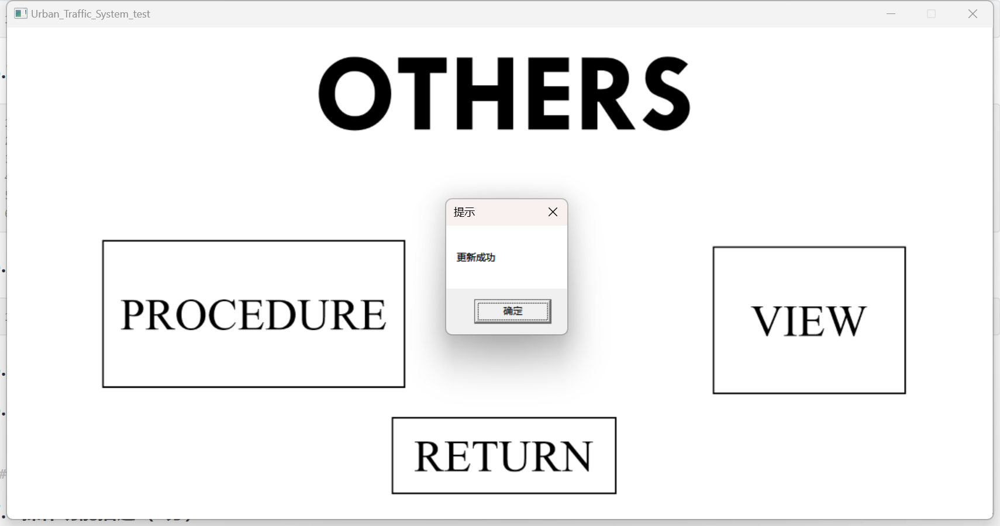

# <center>数据库工程作业报告</center>
## <center>姓名：刘修铭   学号：2112492   专业：信息安全</center>

## 1 项目信息（10分）

### 1.1 项目名称

​		Urban_Traffic_System

### 1.2 必备环境

​		MySQL，Visual Studio 2022

### 1.3 系统主要功能简介（4分）

​		实现了一个简单的城市交通系统数据库的创建与运行。涵盖了包括城市、车站、乘客、线路、车辆等的信息，实现了各类信息的增删改查操作，并按照实际关系添加了彼此间的逻辑约束。

### 1.4 系统主要页面截图（6分）


## 2 系统配置（10分）

### 2.1 配置步骤（2分）

#### 2.1.1 DBMS

​		百度搜索下载MySQL，下载并安装即可。

#### 2.1.2 高级语言——C++

​		本次工程作业使用C++语言借助EASYX图形库、mysql库在VS2022上完成。配置过程主要参考[ c\c++如何连接mysql数据库（超易上手）_c连接mysql数据库](https://blog.csdn.net/yueliangmua/article/details/127798804)完成。

### 2.2 连接串分析（6分）

```c++
MYSQL* mysql_real_connect(MYSQL *mysql, const char *host, const char *user, const char *passwd, const char *database_name, unsigned int port, const char *unix_socket, unsigned long clientflag);
```

| 序号 |     名称      |                 功能说明                  |         取值         |
| :--: | :-----------: | :---------------------------------------: | :------------------: |
|  1   |     mysql     | 一个 MYSQL结构的指针，表示MySQL连接句柄。 |   mysql_init(NULL)   |
|  2   |     host      |    要连接的MySQL服务器主机名或IP地址。    |      127.0.0.1       |
|  3   |     user      |         连接MySQL服务器的用户名。         |         root         |
|  4   |    passwd     |          连接MySQL服务器的密码。          |      LXMliu2002      |
|  5   | database_name |           要连接的数据库名称。            | urban_traffic_system |
|  6   |     port      |           MySQL服务器的端口号。           |         3306         |
|  7   |  unix_socket  | UNIX套接字的路径，用于连接到本地套接字。  |         NULL         |
|  8   |  clientflag   | 连接标志，可以通过位掩码设置不同的选项。  |          0           |

### 2.3 连接串代码（2分）

```c++
Manager::Manager()
{
	con = mysql_init(NULL);
	//设置字符编码
	mysql_options(con, MYSQL_SET_CHARSET_NAME, "GBK");
	//连接数据库，若连接失败则报错
	if (!mysql_real_connect(con, host, user, pw, database_name, port, NULL, 0))
	{
		fprintf(stderr, "Failed to connect to database : Error:%s\n", mysql_error(con));
		cout << endl;
		return;
	}
}
```


## 3 数据库设计（14分）

### 3.1 数据表（10分）

| 创建顺序 |  数据表   |            主键            |        参照属性         |                        被参照表及属性                        |
| :------: | :-------: | :------------------------: | :---------------------: | :----------------------------------------------------------: |
|    1     |   City    |          city_id           |                         | Station(city_id),Include(city_id),Line(city_id),Setting(city_id) |
|    2     |  Station  |         station_id         |         city_id         |            Include(station_id),Serve(station_id)             |
|    3     |  Include  |   (city_id, station_id)    |   city_id,station_id    |                                                              |
|    4     | Passenger |        passenger_id        |                         |                     Serve(passenger_id)                      |
|    5     |   Serve   | (station_id, passenger_id) | station_id,passenger_id |                                                              |
|    6     |   Line    |          line_id           |         city_id         |       Setting(line_id),Offer(line_id),Vehicle(line_id)       |
|    7     |  Setting  |     (city_id, line_id)     |     city_id,line_id     |                                                              |
|    8     |  Vehicle  |         vehicle_id         |         line_id         |     Offer(vehicle_id),Bus(vehicle_id),Subway(vehicle_id)     |
|    9     |   Offer   |   (line_id, vehicle_id)    |   line_id,vehicle_id    |                                                              |
|    10    |    Bus    |         vehicle_id         |       vehicle_id        |                                                              |
|    11    |  Subway   |         vehicle_id         |       vehicle_id        |                                                              |

### 3.2 关系图（4分）


## 4 含有事务应用的删除操作（13分）

### 4.1 功能描述（1分）

​		将某一站点从数据库中删除。

### 4.2 涉及的表（2分）

* Station
* Include
* Serve

### 4.3 表连接涉及字段（1分）

* ```sql
  WHERE include.station_id = station_id
  ```

* ```sql
  WHERE Serve.station_id = station_id
  ```

### 4.4 删除条件字段描述（1分）

#### 4.4.1 删除Include

```sql
DELETE FROM Include WHERE city_id = city_id AND station_id = station_id;
```

​		删除Include表中station_id与给定值相同的行。

#### 4.4.2 删除Serve

```sql
DELETE FROM Serve WHERE station_id = station_id AND passenger_id = passenger_id;
```

​		删除Serve表中station_id与给定值相同的行。

#### 4.4.3 删除Station

```sql
DELETE FROM Station WHERE station_id = station_id;
```

​		删除Station表中station_id与给定值相同的行。

### 4.5 代码（4分）

```c++
//级联删除 Serve Include
bool Manager::Delete_Station(int Station_id)
{
	//检查数据库中是否有station.station_id，若没有，则报错，说明无法删除
	if (Check_Station_station_id(Station_id))
	{
		HWND hwnd = GetHWnd(); // 获取窗口句柄
		MessageBox(hwnd, "Failed to DELETE data from the table_station: Error: the Station_id does not exist.", "提示", MB_OK);
		return false;
	}

	//级联删除 Includee
	Manager::GetInstance()->Delete_Include(Manager::GetInstance()->Get_Stations_City_id(Station_id), Station_id);
	//级联删除 Serve
	vector<int>tmp = Manager::GetInstance()->Get_Serves_Passenger_id(Station_id);
	int tmpsize = tmp.size();
	while (tmpsize > 0)
	{
		Manager::GetInstance()->Delete_Serve(Station_id, tmp[--tmpsize]);
	}
	
	char sql[2000];
	sprintf_s(sql, "DELETE FROM station WHERE station_id=%d", Station_id);
	//若无法删除，则报错并中断程序
	if (mysql_query(con, sql))
	{
		HWND hwnd = GetHWnd(); // 获取窗口句柄
		MessageBox(hwnd, "Failed to DELETE data from the table_station.", "提示", MB_OK);
		return false;
	}


	return true;
}
bool Manager::Delete_Include(int City_id, int Station_id)
{
	//检查数据库中是否有City_id和Station_id，若没有，则报错，说明无法删除
	if (Check_Include_city_id_station_id(City_id, Station_id))
	{
		HWND hwnd = GetHWnd(); // 获取窗口句柄
		MessageBox(hwnd, "Failed to DELETE data from the table_include: Error: the City_id or Station_id does not exist.", "提示", MB_OK);
		return false;
	}
	
	char sql[2000];
	sprintf_s(sql, "DELETE FROM include WHERE city_id=%d AND station_id=%d", City_id, Station_id);
	//若无法删除，则报错并中断程序
	if (mysql_query(con, sql))
	{
		HWND hwnd = GetHWnd(); // 获取窗口句柄
		MessageBox(hwnd, "Failed to DELETE data to the table_include.", "提示", MB_OK);
		return false;
	}
	
	return true;
}
bool Manager::Delete_Serve(int Station_id, int Passenger_id)
{
	//检查数据库中是否有Station_id和Passenger_id，若没有，则报错，说明无法删除
	if (Check_Serve_station_id_passenger_id(Station_id, Passenger_id))
	{
		HWND hwnd = GetHWnd(); // 获取窗口句柄
		MessageBox(hwnd, "Failed to DELETE data from the table_serve: Error: the Station_id or Passenger_id does not exist.", "提示", MB_OK);
		return false;
	}

	char sql[2000];
	sprintf_s(sql, "DELETE FROM serve WHERE station_id=%d AND passenger_id=%d", Station_id, Passenger_id);
	//若无法删除，则报错并中断程序
	if (mysql_query(con, sql))
	{
		HWND hwnd = GetHWnd(); // 获取窗口句柄
		MessageBox(hwnd, "Failed to DELETE data from the table_serve.", "提示", MB_OK);
		return false;
	}

	return true;
}
```

### 4.6 程序演示（4分）


## 5 触发器控制下的添加操作（20分）

### 5.1 功能描述（1分）

​		添加约束条件，保证数据插入时数据表能维持外键约束。

### 5.2 触发器描述（2分）

​		通过对待插入station数据中的city_id的检索，判断City表中是否存在该city_id，若不存在，则弹窗报错，插入失败；若存在，则检索该(station_id,city_id)组合是否存在，若存在则不予插入，若不存在，则正常插入。

### 5.3 涉及的表（1分）

* City
* Station

### 5.4 输入数据（2分）

* 不违背触发器：100，beijingbei，1，1，1
* 违背触发器：100，beijingbei，1，1，0

### 5.5 插入操作源码（3分）

```c++
char sql[2000];
sprintf_s(sql, "INSERT into station (station_id, name, latitude, longitude, city_id) values(%d,'%s',%f,%f,%d)",		station.station_id, station.name.c_str(), station.latitude, station.longitude, station.city_id);
//若无法插入，则报错并中断程序
if (mysql_query(con, sql))
{
    HWND hwnd = GetHWnd(); // 获取窗口句柄
    MessageBox(hwnd, "Failed to INSERT data to the table_station.", "提示", MB_OK);
	return false;
}
//级联插入 Include
Include tmp_include(station.city_id, station.station_id);
Manager::GetInstance()->Insert_Include(tmp_include);
```

### 5.6 触发器源码（3分）

```c++
//检查数据库中是否有该station.city_id，若没有，则报错，说明无法插入
if (Check_City_city_id(station.city_id))
{
	HWND hwnd = GetHWnd(); // 获取窗口句柄
	MessageBox(hwnd, "Failed to INSERT data to the table_station: Error: the station.city_id does not exist.", "提示", MB_OK);
	return false;
}

//检查数据库中是否有station.station_id和station.city_id，若有，则报错，说明无法插入
if (!Check_Station_station_id_city_id(station.station_id, station.city_id))
{
	HWND hwnd = GetHWnd(); // 获取窗口句柄
	MessageBox(hwnd, "Failed to INSERT data to the table_station: Error: the station.station_id and station.city_id have existed already.", "提示", MB_OK);
	return false;
}
```

### 5.7 程序演示：不违背触发器能够执行插入操作（4分）


### 5.8 程序演示：违背触发器要求，不能够执行插入操作，系统报错（4分）


## 6 存储过程控制下的更新操作（18分）

### 6.1 功能描述（1分）

​		按照给定city_id更新其population数据。

### 6.2 存储过程功能描述（1分）

​		给定city_id后，按照给定的population值更新其属性，保证name不发生变动。

### 6.3 涉及的关系表（2分）

* City

### 6.4 表连接涉及字段（1分）

* city_id

### 6.5 更改字段（2分）

* population

### 6.6 更新代码（3分）

```sql
UPDATE City SET population = new_population WHERE city_id = new_city_id;
```

### 6.7 创建存储过程源码（3分）

```SQL
DELIMITER \\
CREATE PROCEDURE UpdatePopulation(IN new_city_id INT, IN new_population INT)
BEGIN
UPDATE City SET population = new_population WHERE city_id = new_city_id;
end; \\
DELIMITER ;
```

### 6.8 存储过程执行源码（1分）

```sql
CALL UpdateCityPopulation(city_id, population);
```

### 6.9 程序演示：不违背存储过程，能够执行更新操作（2分）





### 6.10 程序演示：违背存储过程，系统报错（2分）


## 7 含有视图的查询操作（15分）

### 7.1 操作功能描述（1分）

​		查看一个城市中建立的车站数。

### 7.2 视图功能描述（1分）

​		将City与Station表连接，建立可动态更新的视图Station_Count，实现城市中车站数量的动态更新。

### 7.3 涉及的关系表（2分）

* City
* Station

### 7.4 表连接字段（1分）

```sql
GROUP BY city_id
```

### 7.5 创建视图代码（3分）

```C++
char sql1[2000];
sprintf_s(sql1, "CREATE VIEW Station_Count(city_id, countstations) AS SELECT city_id, COUNT(*) FROM station GROUP BY city_id;");
mysql_query(con, sql1);
```

### 7.6 查询代码（3分）

```c++
char sql2[2000];
sprintf_s(sql2, "SELECT * FROM Station_Count");
mysql_query(con, sql2);
```

### 7.7 程序演示（4分）


