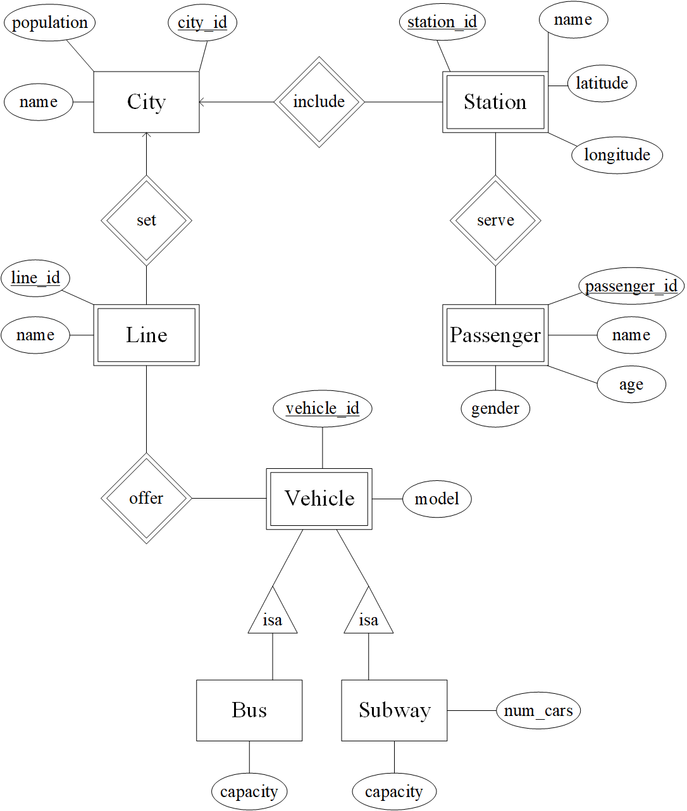
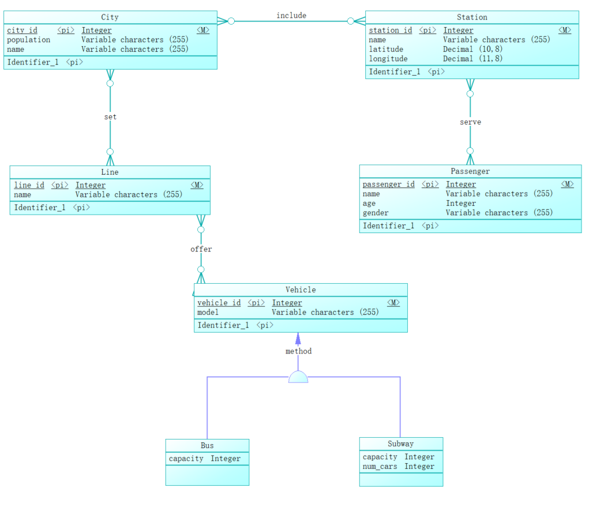
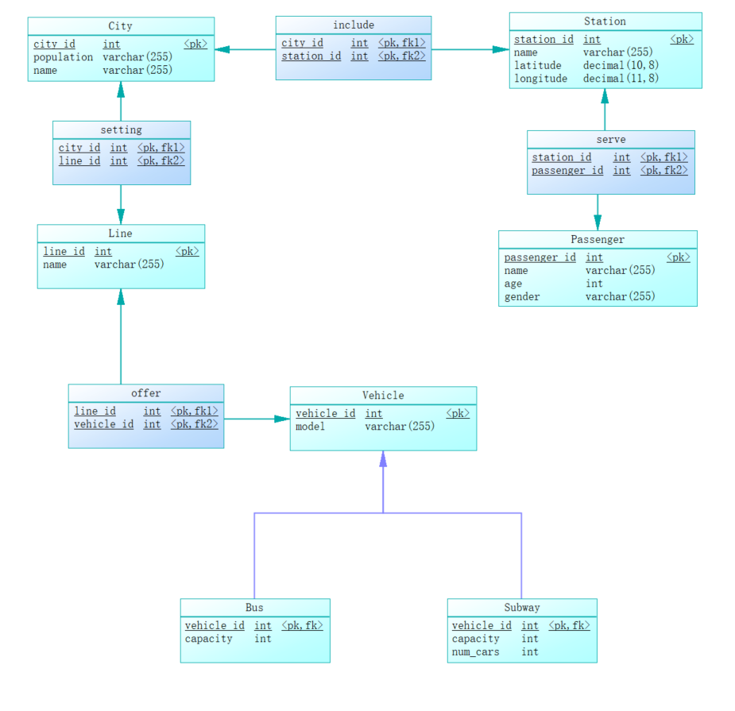

# <center>期末工程作业设计</center>

## <center>2112492&emsp;&emsp;刘修铭</center>
##  <center>城市交通系统(Urban_Traffic_System)的数据库设计</center>

### 1.应用领域详细需求描述
&emsp;&emsp;城市交通系统是指通过各种交通工具（包括公共交通工具和私人交通工具）连接城市中各个地点的系统。城市交通系统的需求包括：

* 实时交通信息的获取和分析，以便及时调整交通流量，减少拥堵和交通事故发生的可能性。
* 公共交通路线和时刻表的管理和优化，以便提高交通效率和公众出行体验。
* 道路网络规划和维护，以便提高交通安全和城市的整体规划。
* 私人交通工具管理和监管，以便保障城市的公共利益和环境保护。
### 2.采用教材方法完成设计

#### a.概念模型ER图



#### b.将ER图转换为关系模式并标注主键属性和外键属性
* City (city_id, name, population)
  * PK: city_id
* Station (station_id, name, latitude, longitude, city_id)
  * PK: station_id
  * FK: city_id (references City.city_id)
* Line (line_id, name, city_id)
  * PK: line_id
  * FK: city_id (references City.city_id)
* Vehicle (vehicle_id, model, line_id)
  * PK: vehicle_id
  * FK: line_id (references Line.line_id)
* Bus (vehicle_id, capacity)
  * PK: vehicle_id
  * FK: vehicle_id (references Vehicle.vehicle_id)
* Subway (vehicle_id, capacity, num_cars)
  * PK: vehicle_id
  * FK: vehicle_id (references Vehicle.vehicle_id)
* Passenger (passenger_id, name, age, gender, station_id)
  * PK: passenger_id
  * FK: station_id (references Station.station_id)
#### c.用SQL语句创建上述关系模式
```sql
CREATE TABLE City (
    city_id INT PRIMARY KEY,
    name VARCHAR(255),
    population INT
);

CREATE TABLE Station (
    station_id INT PRIMARY KEY,
    name VARCHAR(255),
    latitude DECIMAL(10, 8),
    longitude DECIMAL(11, 8),
    city_id INT,
    FOREIGN KEY (city_id) REFERENCES City(city_id)
);

CREATE TABLE Line (
    line_id INT PRIMARY KEY,
    name VARCHAR(255),
    type VARCHAR(255),
    city_id INT,
    FOREIGN KEY (city_id) REFERENCES City(city_id)
);

CREATE TABLE Vehicle (
    vehicle_id INT PRIMARY KEY,
    model VARCHAR(255),
    type VARCHAR(255),
    line_id INT,
    FOREIGN KEY (line_id) REFERENCES Line(line_id)
);

CREATE TABLE Bus (
    vehicle_id INT PRIMARY KEY,
    capacity INT,
    FOREIGN KEY (vehicle_id) REFERENCES Vehicle(vehicle_id)
);

CREATE TABLE Subway (
    vehicle_id INT PRIMARY KEY,
    capacity INT,
    num_cars INT,
    FOREIGN KEY (vehicle_id) REFERENCES Vehicle(vehicle_id)
);

CREATE TABLE Passenger (
    passenger_id INT PRIMARY KEY,
    name VARCHAR(255),
    age INT,
    gender VARCHAR(255),
    station_id INT,
    FOREIGN KEY (station_id) REFERENCES Station(station_id)
);
```
#### d.查询语句样例
* 单表查询
```sql
SELECT * FROM Station;
```
* 多表连接查询
```sql
SELECT Passenger.PassengerName, Train.TrainNo, Station.StationName, Seat.SeatNo
FROM Passenger, Ticket, Train, Station, Seat
WHERE Passenger.PassengerID = Ticket.PassengerID AND
      Ticket.TrainNo = Train.TrainNo AND
      Ticket.StationID = Station.StationID AND
      Ticket.SeatID = Seat.SeatID AND
      Ticket.DepartureTime BETWEEN '2023-05-01 00:00:00' AND '2023-05-07 00:00:00';
```
* 多表嵌套查询
```sql
SELECT Train.TrainNo, Train.StartTime, Train.EndTime
FROM Train
WHERE Train.StartStationID IN (
  SELECT Station.StationID
  FROM Station, City
  WHERE Station.CityID = City.CityID AND City.CityName = '北京'
) AND Train.StartTime BETWEEN '2023-05-01 00:00:00' AND '2023-05-07 00:00:00';
```
* EXISTS查询
```sql
SELECT EXISTS (
  SELECT *
  FROM Train, Station AS s1, Station AS s2, City AS c1, City AS c2
  WHERE Train.StartStationID = s1.StationID AND Train.EndStationID = s2.StationID AND
        s1.CityID = c1.CityID AND c1.CityName = '北京' AND
        s2.CityID = c2.CityID AND c2.CityName = '上海' AND
        Train.StartTime BETWEEN '2023-05-01 00:00:00' AND '2023-05-07 00:00:00'
);
```
* 聚合操作查询
```sql
SELECT AVG(PassengerCount) AS AveragePassengerCount
FROM (
  SELECT COUNT(*) AS PassengerCount
  FROM Ticket
  WHERE DepartureTime BETWEEN '2023-05-01 00:00:00' AND '2023-05-07 00:00:00'
  GROUP BY StationID
) AS PassengerCounts;
```
### 3.采用PowerDesigner工具完成设计
#### a.概念模型ER图



#### b.将ER图转换为关系模式图



#### c.生成创建数据库的SQL语句

```sql
/*==============================================================*/
/* DBMS name:      MySQL 5.0                                    */
/* Created on:     2023/4/4 14:22:03                            */
/*==============================================================*/


drop table if exists Bus;

drop table if exists City;

drop table if exists Line;

drop table if exists Passenger;

drop table if exists Station;

drop table if exists Subway;

drop table if exists Vehicle;

drop table if exists include;

drop table if exists offer;

drop table if exists serve;

drop table if exists setting;

/*==============================================================*/
/* Table: City                                                  */
/*==============================================================*/
create table City
(
   city_id              int not null PRIMARY KEY,
   population           int(255),
   name                 varchar(255)
);

/*==============================================================*/
/* Table: Station                                               */
/*==============================================================*/
create table Station
(
   station_id           int not null PRIMARY KEY,
   name                 varchar(255),
   latitude             decimal(10,8),
   longitude            decimal(11,8),
   city_id              int not null,
   FOREIGN KEY (city_id) REFERENCES City(city_id)
);


/*==============================================================*/
/* Table: include                                               */
/*==============================================================*/
create table include
(
   city_id              int not null,
   station_id           int not null,
   primary key (city_id, station_id),
   FOREIGN KEY (city_id) REFERENCES City (city_id),
   FOREIGN KEY (station_id) REFERENCES Station (station_id)
);

/*==============================================================*/
/* Table: Passenger                                             */
/*==============================================================*/
create table Passenger
(
   passenger_id         int not null PRIMARY KEY,
   name                 varchar(255),
   age                  int,
   gender               varchar(255)
);

/*==============================================================*/
/* Table: serve                                                 */
/*==============================================================*/
create table serve
(
   station_id           int not null,
   passenger_id         int not null,
   primary key (station_id, passenger_id), 
   FOREIGN KEY (station_id) REFERENCES Station (station_id),
   FOREIGN KEY (passenger_id) REFERENCES Passenger (passenger_id)
);

/*==============================================================*/
/* Table: Line                                                  */
/*==============================================================*/
create table Line
(
   line_id              int not null PRIMARY KEY,
   name                 varchar(255),
   city_id              int not null,
   FOREIGN KEY (city_id) REFERENCES City(city_id)
);

/*==============================================================*/
/* Table: setting                                               */
/*==============================================================*/
create table setting
(
   city_id              int not null,
   line_id              int not null,
   primary key (city_id, line_id),
   FOREIGN KEY (line_id) REFERENCES Line (line_id),
   FOREIGN KEY (city_id) REFERENCES City (city_id)
);

/*==============================================================*/
/* Table: Vehicle                                               */
/*==============================================================*/
create table Vehicle
(
   vehicle_id           int not null PRIMARY KEY,
   model                varchar(255),
   line_id              int not null,
   FOREIGN KEY (line_id) REFERENCES Line(line_id)
);

/*==============================================================*/
/* Table: offer                                                 */
/*==============================================================*/
create table offer
(
   line_id              int not null,
   vehicle_id           int not null,
   primary key (line_id, vehicle_id),
   FOREIGN KEY (line_id) REFERENCES Line (line_id),
   FOREIGN KEY (vehicle_id) REFERENCES Vehicle (vehicle_id)
);

/*==============================================================*/
/* Table: Bus                                                   */
/*==============================================================*/
create table Bus
(
   vehicle_id           int not null PRIMARY KEY,
   capacity             int,
   FOREIGN KEY (vehicle_id) REFERENCES Vehicle(vehicle_id)
);

/*==============================================================*/
/* Table: Subway                                                */
/*==============================================================*/
create table Subway
(
   vehicle_id           int not null PRIMARY KEY,
   capacity             int,
   num_cars             int,
   FOREIGN KEY (vehicle_id) REFERENCES Vehicle(vehicle_id)
);
```
### 4.分析比较上述两种方法

#### a.两种关系模式的设计是否存在差异？如有差异，这种差异是否对后期的实现带来不同的影响？

&emsp;&emsp;采用直接设计和使用PowerDesigner设计然后生成SQL的语句在语法上没有本质的差异，它们最终生成的SQL语句可以是一样的，只不过使用PowerDesigner可以更加高效地完成数据库设计和代码生成的过程。具体差异如下：
* 设计效率：使用PowerDesigner可以快速完成数据库的设计和代码生成，提高了设计效率，减少了手工编写SQL语句的工作量。
* 设计精度：PowerDesigner具有强大的数据建模和验证功能，可以检测和修复设计中的错误，避免了手工编写SQL语句时可能出现的语法错误。
* 设计规范：PowerDesigner可以根据设计规范自动生成规范的SQL语句，确保生成的代码符合行业标准和最佳实践。
* 附加语句：使用PowerDesigner生成的SQL语句可能会包含一些附加语句，例如建表前先删除已有的表，或者添加外键关系等。这些语句的作用是确保生成的代码在不同的环境中都能正确执行，并且保证数据库的完整性和一致性。手工编写SQL语句时，这些语句需要自己添加，而使用PowerDesigner则会自动生成。
#### b.PowerDesigner工具生成的SQL语句有什么样的特点？ 为什么会出现一些附加语句？它的作用是什么？
* PowerDesigner工具生成的SQL语句具有以下几个特点：
  * 格式规范：PowerDesigner生成的SQL语句格式规范，易于阅读和理解。
  * 完备性：生成的SQL语句完整地反映了数据库设计的所有对象和约束条件。
  * 可移植性：PowerDesigner生成的SQL语句具有较好的可移植性，可以在不同的数据库管理系统中执行。
* 附加语句是指在生成SQL语句的过程中，工具自动生成的一些额外的语句。这些语句的作用是为了确保生成的SQL语句可以在目标数据库中正确地执行。例如，可能会生成一些额外的语句来确保表的创建顺序和外键约束的正确性。此外，附加语句还可以用来设置数据库的默认参数或其他定制化的需求。


